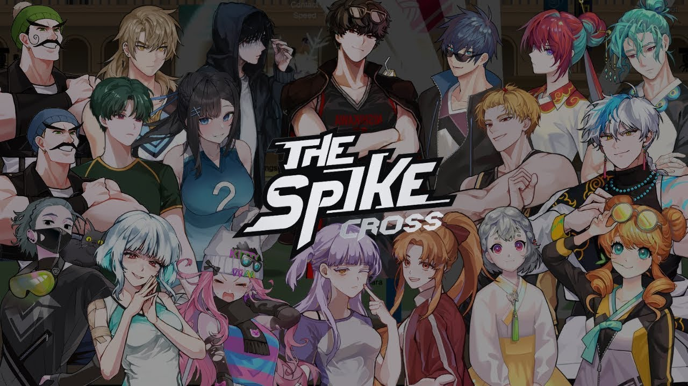

# Codex Pets

这是一个可分享的 Codex 自定义 Pet 集合。

## 下载

在 GitHub 仓库页面点击 **Code → Download ZIP**，或使用 Git 克隆：

```bash
git clone https://github.com/The-time-forever/Codex-Pets.git
```

下载或克隆后，进入本仓库目录。每个 Pet 都必须保留自己的完整文件夹，例如：

```text
Codex-Pets/
└── The Spike Cross/
    ├── hari-midnight/
    │   ├── pet.json
    │   └── spritesheet.webp
    └── xu-sha-la/
        ├── pet.json
        └── spritesheet.webp
```

## 安装（推荐：不用命令行，直接拖文件夹）

### Windows

1. 打开"文件资源管理器"（快捷键 `Win + E`）。
2. 在顶部地址栏输入 `%USERPROFILE%\.codex\pets`，按回车。
   - 如果提示目录不存在，先手动新建：在 `%USERPROFILE%\.codex` 目录下新建一个名为 `pets` 的文件夹（如果 `.codex` 也不存在，就先在用户主目录下新建 `.codex`，再在里面新建 `pets`）。
3. 打开另一个资源管理器窗口，进入下载好的 `Codex-Pets\The Spike Cross` 文件夹。
4. 把想要安装的 Pet 文件夹（比如整个 `hari-midnight` 文件夹）直接拖到第 2 步打开的 `pets` 窗口里。
   - 想装多个，就把每个 Pet 的文件夹都拖过去。
   - 注意：一定要拖整个文件夹，不要只拖里面的某个文件。

### macOS

1. 打开"访达"（Finder）。
2. 按 `Cmd + Shift + G`，输入 `~/.codex/pets`，回车前往（如果不存在会提示，需要先手动新建 `~/.codex` 和里面的 `pets` 文件夹）。
3. 打开另一个访达窗口，进入下载好的 `Codex-Pets/The Spike Cross` 文件夹。
4. 把想要安装的 Pet 文件夹整个拖到 `pets` 窗口里。

安装完成后，重启 Codex，让应用重新读取 Pet 文件。安装后的目录结构应类似：

```text
Windows: %USERPROFILE%\.codex\pets\hari-midnight\pet.json
macOS/Linux: ~/.codex/pets/hari-midnight/pet.json
```

### 进阶：用命令行安装（适合熟悉终端的用户）

<details>
<summary>点击展开命令行安装方法</summary>

**Windows PowerShell**

```powershell
$pets = Join-Path $env:USERPROFILE ".codex\pets"
$source = ".\The Spike Cross"
New-Item -ItemType Directory -Force $pets | Out-Null
Copy-Item -Recurse -Force "$source\hari-midnight", "$source\xu-sha-la" $pets
```

如果只想安装其中一个，例如 `hari-midnight`：

```powershell
$pets = Join-Path $env:USERPROFILE ".codex\pets"
New-Item -ItemType Directory -Force $pets | Out-Null
Copy-Item -Recurse -Force ".\The Spike Cross\hari-midnight" $pets
```

**macOS / Linux**

```bash
mkdir -p "$HOME/.codex/pets"
cp -R "./The Spike Cross/hari-midnight" "./The Spike Cross/xu-sha-la" "$HOME/.codex/pets/"
```

</details>

## 注意事项

- 必须复制整个 Pet 文件夹，不能只复制 `spritesheet.webp`。
- `pet.json` 和 `spritesheet.webp` 必须位于同一文件夹内。
- 不要修改 `pet.json` 中的 `id`，否则可能导致 Pet 重复或无法识别。
- 如果目标目录中已有同名 Pet，复制时会覆盖旧版本；如需保留旧版本，请先备份。
- 这些 Pet 使用 `spriteVersionNumber: 2`，需要支持 Codex 自定义 Pet 的版本。

## 制作自定义 Pet

如果想自己制作一个 Pet，可以使用 Codex 内置的 `Hatch Pet` 技能包：

1. 准备一张参考图（角色立绘、头像等）。
2. 在 Codex 对话框中粘贴参考图，并输入 `/Hatch Pet`，附上你的提示词（Prompt）。
3. 等待孵化完成。
4. 如想分享，可将生成的文件导出到对应分类目录下的 Pet 文件夹中。

## 贡献

欢迎提交新的 Pet、动画素材、安装改进或文档修正。

1. Fork 本仓库并创建一个新的分支。
2. 在合适的分类目录下添加或修改 Pet 文件夹。
3. 确保每个 Pet 文件夹同时包含 `pet.json` 和 `spritesheet.webp`。
4. 保持 `pet.json` 中的 `id` 与文件夹名称一致，并使用唯一的 `id`。
5. 本地确认文件结构和安装说明无误后，提交 Commit 并推送分支。
6. 创建 Pull Request，并简要说明改动内容。

提交新 Pet 时，请尽量附上 Pet 名称、简短介绍、预览图或演示说明，方便审核和使用。

目前仓库内仅有 The Spike Cross 分类的部分角色，个人时间和精力有限，素材质量难免有不足之处，敬请谅解。也欢迎各位大佬进行优化和指正。

